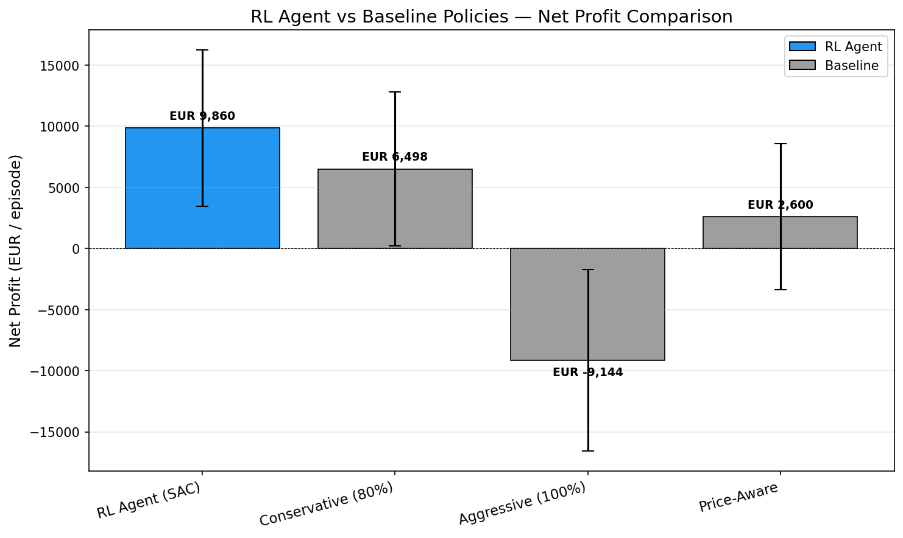
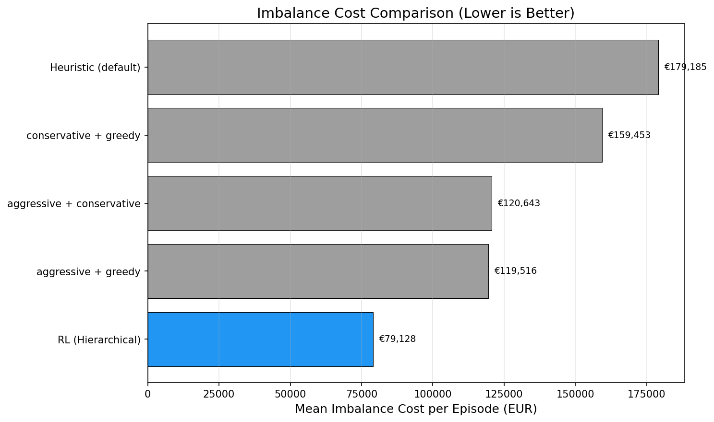
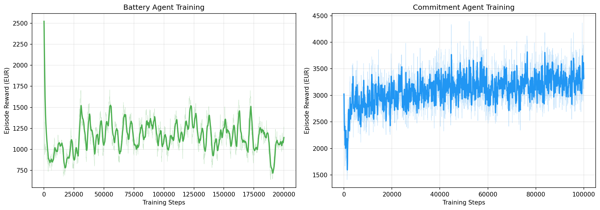

# Solar Merchant RL

**Teaching AI to trade solar energy on electricity markets**

An AI agent learns to operate a solar farm with battery storage, making daily trading decisions on the wholesale electricity market. The result: **+13.8% higher profits** than the best rule-based strategy.



---

## Why This Project?

### The Real-World Problem

Imagine you own a 20 MW solar farm (enough to power ~5,000 homes). Every day at 11:00 AM, you must tell the electricity grid exactly how much energy you'll deliver tomorrow, hour by hour. Get it wrong, and you pay hefty penalties:

- **Deliver less than promised?** Pay 1.5× the market price to buy replacement power
- **Deliver more than promised?** Get only 0.6× the market price for your surplus

The challenge: **solar production is unpredictable** (clouds, weather changes), and **electricity prices swing wildly** (€0 to €300+ per MWh). How do you decide what to promise?

### Why AI?

Simple rules like "always promise 80% of the forecast" can't capture nuanced patterns:

> *"On cloudy autumn afternoons when prices spike at 6 PM, promise less at noon but save battery power for the evening peak"*

This requires learning from years of price and weather data to find patterns humans might miss.

### The Twist: We Proved RL Can Beat Simple Rules

In a [previous project](https://github.com/AdrienSourdworking/Solar_Home_Assistant_V2), we found that for home batteries with fixed electricity tariffs, **simple rules beat AI**. The problem was too simple for machine learning to add value.

This project deliberately creates a harder problem:
- Dynamic wholesale prices (not fixed tariffs)
- Day-ahead commitments (not just hour-by-hour)
- Forecast uncertainty (15-25% error)
- Asymmetric penalties (short ≠ long)

**Result**: RL now significantly outperforms rule-based approaches.

---

## Our Approach: Hierarchical Agents

We split the problem into two specialized AI agents that work together:

```
┌─────────────────────────────────────────────────────────────┐
│                    HIERARCHICAL SYSTEM                       │
├─────────────────────────────────────────────────────────────┤
│                                                              │
│   ┌──────────────────────┐                                   │
│   │  COMMITMENT AGENT    │  Runs once daily at 11:00 AM     │
│   │  "What should we     │                                   │
│   │   promise to deliver │  Inputs: Weather forecast,        │
│   │   tomorrow?"         │          Price forecast,          │
│   │                      │          Battery level            │
│   └──────────┬───────────┘                                   │
│              │                                               │
│              ▼ 24-hour delivery schedule                     │
│                                                              │
│   ┌──────────────────────┐                                   │
│   │  BATTERY AGENT       │  Runs every hour                  │
│   │  "How do we meet     │                                   │
│   │   today's promises?" │  Inputs: Current solar output,    │
│   │                      │          Commitment for this hour,│
│   │                      │          Battery level            │
│   └──────────────────────┘                                   │
│                                                              │
└─────────────────────────────────────────────────────────────┘
```

**Why two agents?**
- Different timescales: daily planning vs. hourly execution
- Different inputs: forecasts vs. real-time data
- Easier to train: each agent focuses on one task

Both agents use **SAC (Soft Actor-Critic)**, a state-of-the-art reinforcement learning algorithm that balances exploration and exploitation.

---

## Results

### The AI Beats All Rule-Based Strategies

We tested 12 combinations of commitment strategies (conservative, aggressive, price-aware) and battery strategies (greedy, conservative, smoothing, do-nothing):

| Strategy | Daily Profit | vs. RL Agent |
|----------|-------------|--------------|
| **RL Agent (Ours)** | **€10,689** | — |
| Aggressive + Greedy | €9,389 | -12.2% |
| Aggressive + Conservative | €9,242 | -13.5% |
| Conservative + Greedy | €7,480 | -30.0% |
| Default Heuristic | €6,550 | -38.7% |

### How the AI Wins: Smarter Risk Management

The key insight: **the AI learned to reduce imbalance costs by 34%** while still maximizing revenue.



Rule-based strategies either:
- **Over-commit** (aggressive): High revenue but big penalties when forecasts are wrong
- **Under-commit** (conservative): Low penalties but leaves money on the table

The AI finds the sweet spot, adapting its strategy to market conditions.

### Training Progress

Both agents learned steadily over training:



- **Battery Agent**: 2,083 training episodes
- **Commitment Agent**: 10,000 training episodes

---

## The Solar Farm

| Specification | Value | Notes |
|---------------|-------|-------|
| Solar Capacity | 20 MW | Peak power output |
| Battery Storage | 10 MWh | ~30 minutes at full power |
| Battery Power | 5 MW | Max charge/discharge rate |
| Efficiency | 92% | Round-trip battery efficiency |
| Location | France | Uses real French market prices |
| Data Period | 2015-2023 | 7 years training, 2 years testing |

**Constraint**: The battery can only charge from solar surplus, not from the grid. This prevents simple price arbitrage and forces the AI to learn production smoothing.

---

## Quick Start

### Prerequisites

```bash
pip install gymnasium stable-baselines3 pandas numpy torch tabulate
```

### Run Evaluation

```bash
# Compare trained AI against all baselines
python src/evaluation/evaluate_hierarchical_baselines.py

# View detailed agent performance
python src/evaluation/evaluate_hierarchical.py
```

### Train From Scratch

```bash
# 1. Prepare the dataset
python src/data_processing/prepare_dataset.py

# 2. Train the battery agent
python src/training/train_battery.py

# 3. Train the commitment agent
python src/training/train_commitment.py

# 4. Evaluate
python src/evaluation/evaluate_hierarchical_baselines.py
```

### Monitor Training

```bash
tensorboard --logdir outputs/battery_agent/tensorboard
tensorboard --logdir outputs/commitment_agent/tensorboard
```

---

## Project Structure

```
Solar_Merchant_RL/
├── data/
│   ├── prices/              # French day-ahead prices (2015-2025)
│   ├── weather/             # Solar irradiance, temperature
│   └── processed/           # Merged train/test datasets
├── src/
│   ├── environment/         # Gym environments for both agents
│   │   ├── battery_env.py       # Battery control environment
│   │   ├── commitment_env.py    # Commitment decision environment
│   │   └── hierarchical_orchestrator.py  # Combines both agents
│   ├── baselines/           # Rule-based comparison policies
│   ├── training/            # Training scripts
│   └── evaluation/          # Evaluation and visualization
├── models/                  # Trained agent checkpoints
│   ├── battery_agent/
│   └── commitment_agent/
├── results/
│   ├── figures/             # Generated charts
│   └── metrics/             # Evaluation CSVs
└── outputs/                 # TensorBoard logs
```

---

## Key Findings

### 1. Hierarchical Decomposition Works

Splitting the problem into two agents made training faster and more stable than a single monolithic agent. Each agent can focus on its specific task.

### 2. The AI Learns Risk Management

The biggest improvement came from **reducing imbalance costs**, not from committing to higher volumes. The AI learned to be appropriately cautious when forecasts are uncertain.

### 3. Problem Complexity Matters for RL

In our previous work, simple home battery control didn't benefit from RL. This wholesale trading problem has enough complexity (price volatility, asymmetric penalties, forecast uncertainty) for RL to shine.

### 4. Baseline Comparisons Are Essential

Without rigorous comparison to rule-based strategies, it's easy to claim RL "works" when simple rules would do better. Our 12 baseline combinations provide a strong benchmark.

---

## Technical Details

### State Spaces

**Commitment Agent** (56 dimensions):
- 24-hour PV forecast (normalized)
- 24-hour price forecast (normalized)
- Current battery SOC
- Weather features (temperature, irradiance)
- Seasonal/time encodings

**Battery Agent** (17 dimensions):
- Current hour, battery SOC
- Current commitment and actual PV
- Next 6 hours: commitments and forecasts
- Cumulative imbalance, current price

### Action Spaces

**Commitment Agent**: 24 continuous values [0,1] → commitment fractions per hour
**Battery Agent**: 1 continuous value [0,1] → 0=full discharge, 0.5=idle, 1=full charge

### Reward Function

```
reward = revenue - imbalance_penalty - battery_degradation
```

Where:
- Revenue = delivered × day-ahead price
- Imbalance = penalty for over/under delivery
- Degradation = €0.01 per MWh battery throughput

---

## Data Sources

- **Electricity Prices**: ENTSO-E French day-ahead market (2015-2025)
- **Solar Production**: PVGIS-derived irradiance data, scaled to 20 MW
- **Forecasts**: Synthetic day-ahead forecasts with realistic 15-25% RMSE error

---

## Future Work

- [ ] Add intraday market for position corrections
- [ ] Multi-site portfolio optimization
- [ ] Uncertainty-aware commitment strategies
- [ ] Deploy to real trading simulation

---

## License

MIT

---

## Acknowledgments

Built with [Stable Baselines3](https://github.com/DLR-RM/stable-baselines3) and [Gymnasium](https://gymnasium.farama.org/).

Electricity price data from [ENTSO-E Transparency Platform](https://transparency.entsoe.eu/).
