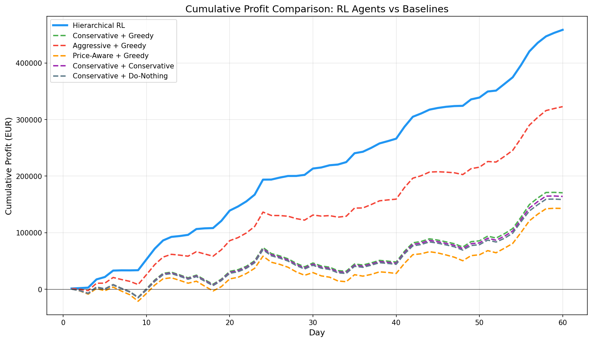
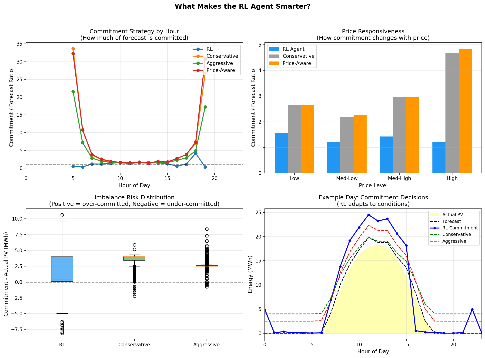
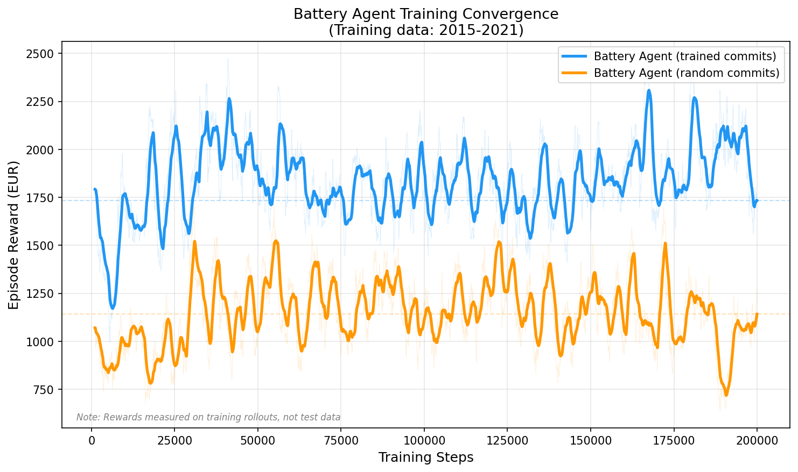
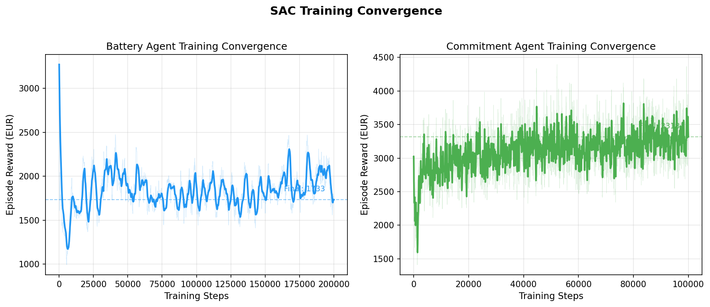

# Solar Merchant RL

**Teaching AI to trade solar energy on electricity markets**

A hierarchical RL system learns to operate a solar farm with battery storage, making daily trading decisions on the wholesale electricity market. The result: **+42% higher profits** than the best rule-based strategy.



---

## Why This Project?

### The Real-World Problem

Imagine you own a 20 MW solar farm (enough to power ~5,000 homes). Every day at 11:00 AM, you must tell the electricity grid exactly how much energy you'll deliver tomorrow, hour by hour. Get it wrong, and you pay hefty penalties:

- **Deliver less than promised?** Pay 1.5x the market price to buy replacement power
- **Deliver more than promised?** Get only 0.6x the market price for your surplus

The challenge: **solar production is unpredictable** (clouds, weather changes), and **electricity prices swing wildly** (EUR 0 to EUR 300+ per MWh). How do you decide what to promise?

### Why AI?

Simple rules like "always promise 80% of the forecast" can't capture nuanced patterns:

> *"On cloudy autumn afternoons when prices spike at 6 PM, promise less at noon but save battery power for the evening peak"*

This requires learning from years of price and weather data to find patterns humans might miss.

### The Twist: We Proved RL Can Beat Simple Rules

In a [previous project](https://github.com/AdrienSourdworking/Solar_Home_Assistant_V2), we found that for home batteries with fixed electricity tariffs, **simple rules beat AI**. The problem was too simple for machine learning to add value.

This project deliberately creates a harder problem:
- Dynamic wholesale prices (not fixed tariffs)
- Day-ahead commitments (not just hour-by-hour)
- Forecast uncertainty (15-25% error)
- Asymmetric penalties (short != long)

**Result**: RL now significantly outperforms rule-based approaches.

---

## Results

### Performance Comparison (60-Day Test Period)

| Strategy | Total Profit | Daily Average | vs. RL Agent |
|----------|-------------|---------------|--------------|
| **Hierarchical RL (Ours)** | **EUR 458,579** | **EUR 7,643/day** | -- |
| Aggressive + Greedy | EUR 322,833 | EUR 5,381/day | -29.6% |
| Conservative + Greedy | EUR 170,504 | EUR 2,842/day | -62.8% |
| Conservative + Conservative | EUR 164,061 | EUR 2,734/day | -64.2% |
| Conservative + Do-Nothing | EUR 158,608 | EUR 2,643/day | -65.4% |
| Price-Aware + Greedy | EUR 142,901 | EUR 2,382/day | -68.8% |

The RL agents achieve **+42% better profit** than the best baseline (Aggressive + Greedy) and **+170% better** than average baselines.

### What Makes the RL Agent Smarter?



**Key insight: Better risk management**

| Metric | RL Agent | Conservative | Aggressive |
|--------|----------|--------------|------------|
| Mean Imbalance | **+1.59 MWh** | +3.38 MWh | +2.65 MWh |
| Over-committed (penalty risk) | **68%** | 97% | 98% |

The RL agent learned that:
1. **Being short is very expensive** (1.5x penalty) - so avoid over-committing
2. **Being long is cheaper** (only lose 40% of price) - acceptable trade-off
3. **Adapt to conditions** - commit aggressively when confident, conservatively when uncertain

Rule-based policies use fixed ratios (80%, 100%) regardless of conditions. The RL agent adapts dynamically.

---

## Our Approach: Hierarchical Agents

We split the problem into two specialized AI agents that work together:

```
+-------------------------------------------------------------+
|                    HIERARCHICAL SYSTEM                       |
+-------------------------------------------------------------+
|                                                              |
|   +----------------------+                                   |
|   |  COMMITMENT AGENT    |  Runs once daily at 11:00 AM     |
|   |  "What should we     |                                   |
|   |   promise to deliver |  Inputs: Weather forecast,        |
|   |   tomorrow?"         |          Price forecast,          |
|   |                      |          Battery level            |
|   +----------+-----------+                                   |
|              |                                               |
|              v 24-hour delivery schedule                     |
|                                                              |
|   +----------------------+                                   |
|   |  BATTERY AGENT       |  Runs every hour                  |
|   |  "How do we meet     |                                   |
|   |   today's promises?" |  Inputs: Current solar output,    |
|   |                      |          Commitment for this hour,|
|   |                      |          Battery level            |
|   +----------------------+                                   |
|                                                              |
+-------------------------------------------------------------+
```

**Why two agents?**
- Different timescales: daily planning vs. hourly execution
- Different inputs: forecasts vs. real-time data
- Easier to train: each agent focuses on one task

Both agents use **SAC (Soft Actor-Critic)**, a state-of-the-art reinforcement learning algorithm.

---

## Training Convergence

### Commitment Agent
Trained for 100,000 steps, converging to ~3,145 EUR/episode reward.

### Battery Agent
Trained for 200,000 steps with two approaches:



- **SAC_1 (random commits)**: Trained with random commitment schedules - baseline at ~1,268 EUR
- **SAC_2 (trained commits)**: Trained with the commitment agent's decisions - improved to ~1,719 EUR

The battery agent performs **35% better** when working with the trained commitment agent, showing the synergy between the two agents.

### Combined Training View



---

## The Solar Farm

| Specification | Value | Notes |
|---------------|-------|-------|
| Solar Capacity | 20 MW | Peak power output |
| Battery Storage | 10 MWh | ~30 minutes at full power |
| Battery Power | 5 MW | Max charge/discharge rate |
| Efficiency | 92% | Round-trip battery efficiency |
| Location | France | Uses real French market prices |
| Data Period | 2015-2023 | 7 years training, 2 years testing |

**Constraint**: The battery can only charge from solar surplus, not from the grid. This prevents simple price arbitrage and forces the AI to learn production smoothing.

---

## Quick Start

### Prerequisites

```bash
pip install gymnasium stable-baselines3 pandas numpy torch tabulate tensorboard
```

### Run Evaluation

```bash
# Compare trained AI against all baselines (generates cumulative rewards plot)
python src/evaluation/plot_cumulative_rewards.py

# Analyze agent behavior differences
python src/evaluation/analyze_agent_behavior.py

# View training curves
python src/evaluation/plot_training_curves.py
```

### Train From Scratch

```bash
# 1. Prepare the dataset
python src/data_processing/prepare_dataset.py

# 2. Train the commitment agent first
python src/training/train_commitment.py

# 3. Train the battery agent (uses trained commitment agent)
python src/training/train_battery.py --commitment-policy trained

# 4. Evaluate
python src/evaluation/plot_cumulative_rewards.py
```

### Monitor Training

```bash
tensorboard --logdir outputs/battery_agent/tensorboard
tensorboard --logdir outputs/commitment_agent/tensorboard
```

---

## Project Structure

```
Solar_Merchant_RL/
├── data/
│   ├── prices/              # French day-ahead prices (2015-2025)
│   ├── weather/             # Solar irradiance, temperature
│   └── processed/           # Merged train/test datasets
├── src/
│   ├── environment/         # Gym environments for both agents
│   │   ├── battery_env.py       # Battery control environment
│   │   ├── commitment_env.py    # Commitment decision environment
│   │   └── hierarchical_orchestrator.py  # Combines both agents
│   ├── baselines/           # Rule-based comparison policies
│   ├── training/            # Training scripts
│   └── evaluation/          # Evaluation and visualization
├── models/                  # Trained agent checkpoints
│   ├── battery_agent/
│   │   ├── battery_agent_final.zip
│   │   └── best/
│   └── commitment_agent/
│       ├── commitment_agent_final.zip
│       └── best/
└── outputs/                 # TensorBoard logs and figures
    ├── battery_agent/tensorboard/
    ├── commitment_agent/tensorboard/
    ├── cumulative_rewards.png
    ├── training_curves_*.png
    └── agent_behavior_analysis.png
```

---

## Key Findings

### 1. Hierarchical Decomposition Works

Splitting the problem into two agents made training faster and more stable than a single monolithic agent. Each agent can focus on its specific task.

### 2. The AI Learns Asymmetric Risk Management

The biggest improvement came from understanding that **being short is much more expensive than being long**. The AI learned to:
- Commit conservatively during uncertain conditions
- Use the battery as a buffer for unexpected shortfalls
- Accept being slightly long (lost revenue) to avoid being short (heavy penalties)

### 3. Synergy Between Agents

The battery agent performs 35% better when trained alongside the commitment agent vs. random commitments. The agents learn complementary strategies.

### 4. Problem Complexity Matters for RL

In our previous work, simple home battery control didn't benefit from RL. This wholesale trading problem has enough complexity (price volatility, asymmetric penalties, forecast uncertainty) for RL to shine.

---

## Technical Details

### State Spaces

**Commitment Agent** (56 dimensions):
- 24-hour PV forecast (normalized)
- 24-hour price forecast (normalized)
- Current battery SOC
- Weather features (temperature, irradiance)
- Seasonal/time encodings

**Battery Agent** (21 dimensions):
- Current hour, battery SOC
- Current commitment and actual PV
- Next 6 hours: commitments and forecasts
- Cumulative imbalance, current price
- Time features

### Action Spaces

**Commitment Agent**: 24 continuous values [0,1] -> commitment fractions per hour
**Battery Agent**: 1 continuous value [0,1] -> 0=full discharge, 0.5=idle, 1=full charge

### Reward Function

```
reward = revenue - imbalance_penalty - battery_degradation
```

Where:
- Revenue = delivered x day-ahead price
- Imbalance = penalty for over/under delivery (1.5x short, 0.6x long)
- Degradation = EUR 0.01 per MWh battery throughput

---

## Data Sources

- **Electricity Prices**: ENTSO-E French day-ahead market (2015-2025)
- **Solar Production**: PVGIS-derived irradiance data, scaled to 20 MW
- **Forecasts**: Synthetic day-ahead forecasts with realistic 15-25% RMSE error

---

## Future Work

- [ ] Add intraday market for position corrections
- [ ] Multi-site portfolio optimization
- [ ] Uncertainty-aware commitment strategies
- [ ] Deploy to real trading simulation

---

## License

MIT

---

## Acknowledgments

Built with [Stable Baselines3](https://github.com/DLR-RM/stable-baselines3) and [Gymnasium](https://gymnasium.farama.org/).

Electricity price data from [ENTSO-E Transparency Platform](https://transparency.entsoe.eu/).
